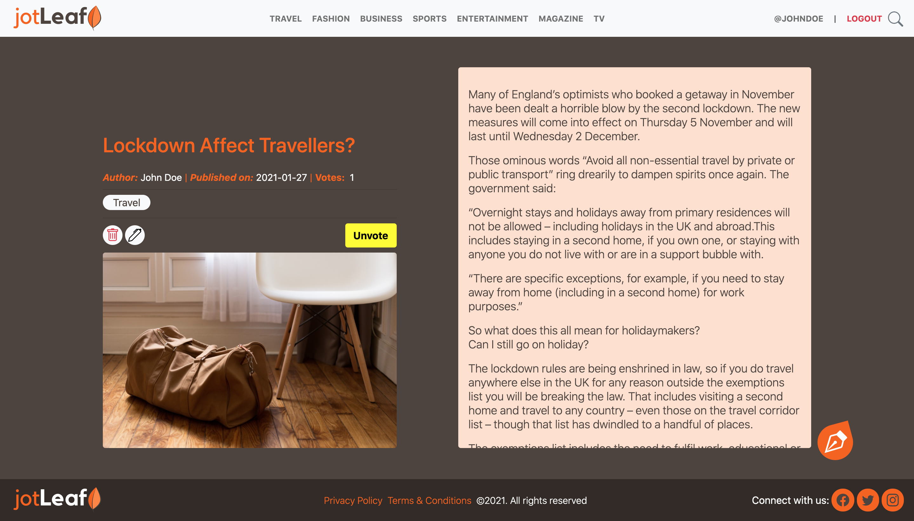

# Jot Leaf

## About

Jot Leaf is a lifestyle blog where users post 'jot' articles. A jot article must have an image attached to it and belong to one or more categories. A category can have many jot articles tagged to them.

## Scrrenshots

## Built With
- Ruby v2.7.0
- Ruby on Rails v6.0.3.4
- Bootstrap v5.0.0.beta1
- HTML5
- CSS(SCSS)

## Getting Started

In other to get a copy up and running on your local machine, follow the step-by-step instruction below.

- clone this repo by running `git clone git@github.com:cyonii/jotleaf.git`
- run `cd jotleaf` to change into the project's directory
- run `bundle install` to install the project's dependencies
- you may need to run `yarn install` to update yarn packages
- run `rails db:create` and `rails db:migrate` to setup database
- run `rails server` to start application
- head over to your browser and open `http//:localhost:3000`

## Live Demo

[Live demo](https://jleaf.herokuapp.com)

### Run Tests

run `rspec` in the containing folder to run tests the application.

## Author

👤 **CY Kalu**

- GitHub: [@cyonii](https://github.com/cyonii)
- Twitter: [@theOnuoha](https://twitter.com/cy_kalu)
- LinkedIn: [Silas Kalu](https://www.linkedin.com/in/cyonii/)

## 🤝 Contributing

Contributions, issues and feature requests are welcome!

Feel free to check the [issues page](../../issues).

## Support

Give a ⭐️ if you like this project!

## Appreciation

Special appreciation to [Nelson Sakwa](https://www.behance.net/sakwadesignstudio) who made the [design](https://www.behance.net/gallery/14554909/liFEsTlye-Mobile-version) used to develop this project's UI.

## 📝 License

This project is [MIT](./LICENSE) licensed.
