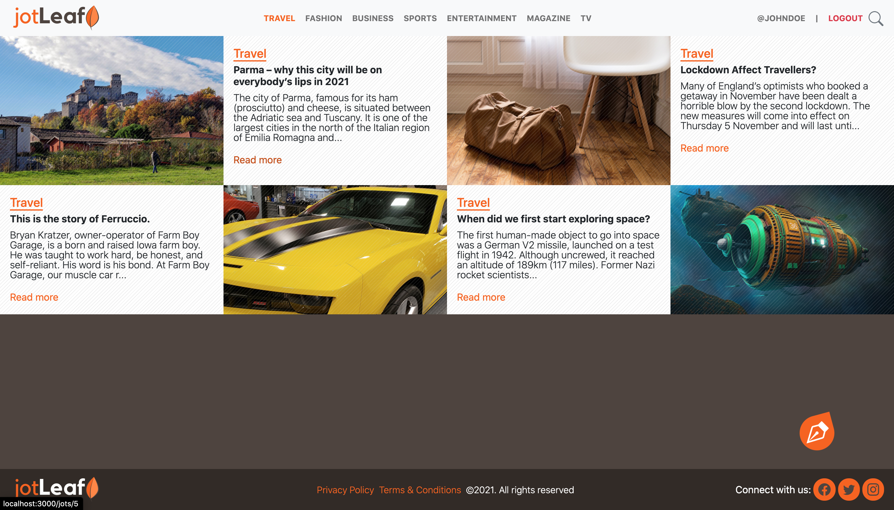

# Jot Leaf

## About

Jot Lea is a lifestyle blog where users can post blog articles with an image attached. Articles on Jot Leaf are grouped by categories, a blog article must belong to at least one or many categories, and categories may have many jot articles tagged to them.

## Scrrenshots

## Built With
- Ruby v2.7.0
- Ruby on Rails v6.0.3.4
- Bootstrap v5.0.0.beta1
- HTML5
- CSS(SCSS)

## Getting Started

Follow the following instructions to run a copy on your local machine.

- clone this repo by running `git clone git@github.com:cyonii/jotleaf.git`
- run `cd jotleaf` to change into directory
- run `bundle install` to install all dependencies
- you may need to run `yarn install` to update yarn packages
- run `rails db:create` and `rails db:migrate` to setup database
- run `rails server` to start application
- head over to your browser and open `http//:localhost:3000`

## Live Demo

[Live demo](https://jleaf.herokuapp.com)

### Run Tests

run `rspec` in the containing folder to run tests the application.

## Authors

👤 **CY Kalu**

- GitHub: [@cyonii](https://github.com/cyonii)
- Twitter: [@theOnuoha](https://twitter.com/theOnuoha)
- LinkedIn: [Silas Kalu](https://www.linkedin.com/in/cyonii/)

## 🤝 Contributing

Contributions, issues and feature requests are welcome!

Feel free to check the [issues page](issues/).

## Support

Give a ⭐️ if you like this project!

## Appreciation

Special thanks to [Nelson Sakwa](https://www.behance.net/sakwadesignstudio) who made the [design](https://www.behance.net/gallery/14554909/liFEsTlye-Mobile-version) used to develop this project.

## 📝 License

This project is [MIT](https://choosealicense.com/licenses/mit/) licensed.  
